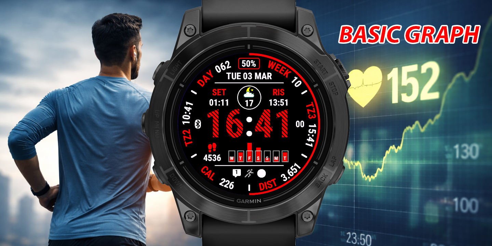
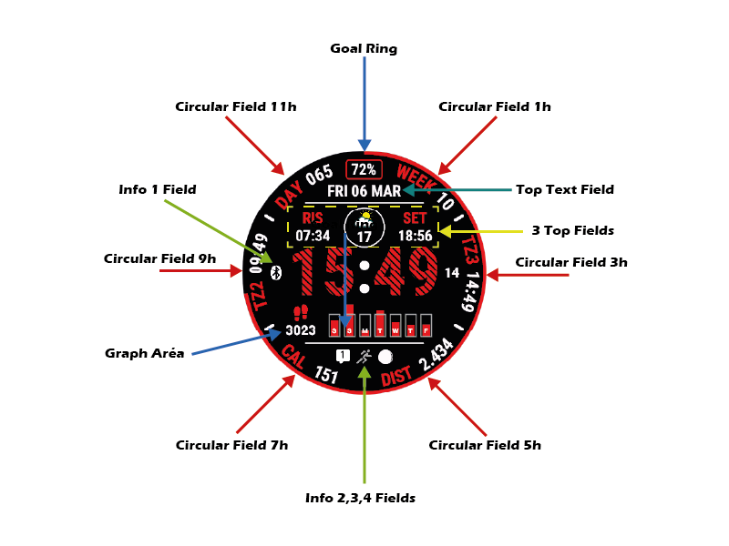

# BASIC GRAPH - Documentación Completa

> ⚠️ **DESCARGO DE RESPONSABILIDAD**: Este repositorio contiene únicamente documentación de usuario. No se incluye código fuente, algoritmos, lógica de backend ni mecanismos de licencia. Cualquier intento de ingeniería inversa del producto está prohibido.

---

## Tabla de Contenidos

1. [Descripción General](#descripción-general)
2. [Características Principales](#características-principales)
3. [Interfaz de Usuario](#interfaz-de-usuario)
4. [Configuración](#configuración)
   - [Configuración del Sistema](#configuración-del-sistema)
   - [Configuración de Pantalla](#configuración-de-pantalla)
   - [Campos de Datos](#campos-de-datos)
   - [Campo Gráfico](#campo-gráfico)
   - [Personalización de Colores](#personalización-de-colores)
   - [Clima](#clima)
5. [Tipos de Datos Disponibles](#tipos-de-datos-disponibles)
6. [Glosario](#glosario)
7. [Apéndices](#apéndices)

---

---

## Descripción General

**BASIC GRAPH** es una esfera de reloj limpia y rica en datos para relojes Garmin Connect IQ. Construida alrededor de un campo gráfico central que muestra datos históricos, combina 6 campos circulares, campos clásicos superiores y una amplia personalización para proporcionar el máximo de información de un vistazo.

### Características Clave

- 📊 **Campo Gráfico Central**: Gráfico de líneas o barras con hasta 4 horas de historial
- 🔵 **6 Campos Circulares**: Posicionados en 1h, 3h, 5h, 7h, 9h, 11h
- 📋 **3 Campos Clásicos Superiores**: Izquierda, Centro, Derecha configurables
- 🎨 **22 Colores Personalizables**: Control completo de colores
- 🌦️ **Integración Meteorológica**: Garmin Weather y OpenWeatherMap
- ⚡ **Optimización de Batería**: Modos de ahorro de energía inteligentes
- 🌍 **Soporte Multilingüe**: 19 idiomas disponibles
- 🎯 **Anillo de Objetivo**: Seguimiento visual del progreso de objetivos

---

## Características Principales

### 1. Visualización de Hora

- Formato 12h o 24h
- Visualización de segundos (3 modos: Oculto, Normal, Siempre Activo)
- Cero inicial opcional para las horas
- Soporte AM/PM en formato 12h
- Colores independientes para horas, minutos, segundos, separador

### 2. Campo Gráfico

La característica central de BASIC GRAPH — un gráfico configurable que muestra datos en serie temporal:

- **Gráfico de Líneas**: Representación en curva continua
- **Gráfico de Barras**: Representación en barras verticales
- **Duración**: 1 a 4 horas de historial (para datos no de 7 días)
- **Modo 7 Días**: Muestra historial de 7 días con letras de días opcionales
- **Línea de objetivo**: Visualización opcional del valor objetivo
- **Objetivo personalizado**: Reemplazar el objetivo del sistema con un valor personalizado

### 3. Campos Circulares de Datos

Seis campos circulares posicionados en las posiciones de reloj 1h, 3h, 5h, 7h, 9h, 11h:

- Visualización de valor
- Título personalizable
- Visualización de unidad
- Múltiples modos de visualización
- Configuración de color independiente

### 4. Campos Clásicos Superiores

Tres campos de datos en la parte superior de la esfera:

- Campo Superior Izquierdo
- Campo Superior Central
- Campo Superior Derecho
- Iconos de colores (conjunto relleno o contorno)
- Valores de texto

### 5. Campo de Texto Superior

- Tipo de dato totalmente configurable
- Múltiples modos de visualización (valor, título+valor, objetivo, etc.)
- Título personalizable

### 6. Indicadores de Información

Cuatro indicadores visuales:

1. **Info 1**: Indicador configurable
2. **Info 2**: Indicador configurable
3. **Info 3**: Indicador configurable
4. **Info 4**: Indicador configurable

### 7. Anillo de Objetivo

- Visualización gráfica del progreso
- Múltiples tipos de datos de objetivo
- Rango configurable (min/max)

### 8. Fecha

- 7 formatos de visualización
- Día de la semana
- Soporte de formato internacional

### 9. Clima

- **Fuentes**: Garmin Weather y/o OpenWeatherMap
- **Datos Disponibles**:
  - Temperatura actual, sensación térmica, min/máx
  - Descripción e icono meteorológico
  - Humedad
  - Velocidad y dirección del viento
  - Presión atmosférica (OWM)
  - Cobertura de nubes (OWM)
  - Visibilidad (OWM)
  - Probabilidad de precipitaciones (GW)

---

## Interfaz de Usuario

### Estructura de la Pantalla

*Disposición de BASIC GRAPH mostrando todas las zonas configurables*

### Leyenda
- **Hora**: Visualización de hora
- **Fecha**: Visualización de fecha
- **Gráfico**: Campo gráfico central
- **Circ 1h/3h/5h/7h/9h/11h**: Campos circulares
- **SI/SC/SD**: Campos superiores (Izquierda/Centro/Derecha)
- **I1/I2/I3/I4**: Indicadores de información
- **Anillo Objetivo**: Anillo de progreso de objetivo

---

## Configuración

### Configuración del Sistema

#### Tasa de Actualización de Datos
Controla la frecuencia de actualización de datos:

- **Actualización Completa**: Actualización completa cada segundo (máximo consumo)
- **Tasa Alta**: Actualización alta
- **Tasa Media**: Actualización media (recomendado)
- **Tasa Baja**: Actualización baja (ahorro de batería)

#### Ahorro de Energía

**Retraso del Salvapantallas**: Retraso en minutos antes de la activación del salvapantallas (-1 para deshabilitar)

**Retraso de Apagado de Pantalla**: Retraso en minutos antes del apagado de pantalla (-1 para deshabilitar)

#### Widget

**Lanzar Widget con Pulsación Larga**: Lanzar widget con pulsación larga (solo pantallas táctiles)

---

### Configuración de Pantalla

#### Formato de Hora

**Usar Formato Militar**:
- `true`: Formato 24 horas
- `false`: Formato 12 horas (AM/PM)

**Cero Inicial en Horas**:
- `true`: Mostrar cero inicial (01, 02, 03...)
- `false`: Sin cero inicial (1, 2, 3...)

**Modo de Visualización de Segundos**:
1. **Oculto**: Segundos ocultos
2. **Normal**: Visualización normal de segundos
3. **Siempre Activo**: Siempre visible

#### Formato de Fecha

7 modos de visualización disponibles:

1. `[DDS dd Mes]`: Lun 15 Enero
2. `[DDS dd/mm]`: Lun 15/01
3. `[dd/mm/aaaa]`: 15/01/2026
4. `[DDS Mes dd]`: Lun Enero 15
5. `[Mes dd DDS]`: Enero 15 Lun
6. `[DDS mm/dd]`: Lun 01/15
7. `[aaaa/mm/dd]`: 2026/01/15

---

### Campos de Datos

#### Configuración de Cada Campo

Para cada campo de datos, puede configurar:

1. **Tipo de Dato**: Elegir entre 73+ tipos (ver sección Tipos de Datos)
2. **Título Personalizado**: Texto libre para reemplazar el título predeterminado
3. **Modo de Visualización**: Cómo mostrar los datos

#### Modos de Visualización

##### Campos Circulares (1h, 3h, 5h, 7h, 9h, 11h)

0. **Valor**: Solo valor
1. **Título + Valor**: Título sobre el valor
2. **Valor + Unidad**: Valor con unidad
3. **Valor + Título**: Valor con título debajo
4. **Título Valor Unidad**: Título, valor, unidad

##### Campo de Texto Superior

0. **Valor**: Solo valor
1. **Título + Valor**: Título y valor
2. **Valor + Unidad**: Valor con unidad
3. **Valor + Título**: Valor con título
4. **Título Valor Unidad**: Título, valor, unidad
5. **Título**: Solo título
6. **Objetivo**: Visualización de objetivo
7. **Valor / Objetivo**: Valor sobre objetivo
8. **Porcentaje de Objetivo**: Porcentaje del objetivo
9. **Restante**: Restante para alcanzar el objetivo

---

### Campo Gráfico

El campo gráfico es el elemento central de BASIC GRAPH.

#### Tipo de Dato del Gráfico

Seleccionar el tipo de dato a mostrar en el gráfico entre todos los tipos disponibles.

#### Modo de Visualización del Gráfico

- **Gráfico de Líneas**: Curva continua
- **Gráfico de Barras**: Barras verticales

#### Duración del Gráfico

Para tipos de datos no de 7 días: duración en horas (1 a 4 horas).

#### Opciones de 7 Días

- **Mostrar Letras de Días**: Mostrar abreviaciones de días bajo las barras
- **Mostrar Objetivo del Gráfico**: Mostrar una línea horizontal de objetivo

#### Configuración del Objetivo

- **Mostrar Objetivo del Gráfico**: Activar/desactivar la línea de objetivo
- **Objetivo Personalizado del Gráfico**: Reemplazar el valor del objetivo del sistema (0 = usar objetivo del sistema)

---

### Personalización de Colores

BASIC GRAPH ofrece **22 colores personalizables**:

| ID | Elemento |
|----|---------|
| 0 | Color de Fondo |
| 1 | Color de Líneas de Separación |
| 2 | Color de Título/Unidad de Campos Circulares |
| 3 | Color de Valor de Campos Circulares |
| 4 | Color de Texto de Campos de Texto |
| 5 | Color de Valor de Campos de Datos |
| 6 | Color de Título/Icono Campo Superior Izquierdo |
| 7 | Color de Título/Icono Campo Superior Central |
| 8 | Color de Título/Icono Campo Superior Derecho |
| 9 | Color de Horas |
| 10 | Color del Separador de Hora |
| 11 | Color de Minutos |
| 12 | Color de Segundos y AM/PM |
| 13 | Color de Valor del Gráfico |
| 14 | Color de Objetivo del Gráfico |
| 15 | Color Info Inactivo |
| 16 | Color Info 1 Activo |
| 17 | Color Info 2 Activo |
| 18 | Color Info 3 Activo |
| 19 | Color Info 4 Activo |
| 20 | Color Anillo Objetivo Inactivo |
| 21 | Color Anillo Objetivo Activo |

### Paleta de Colores Predefinida

La esfera ofrece **67 colores predefinidos** organizados por familia.

➡️ **[Ver la lista completa de colores](https://pay.b65dev.com/portfolio/faqs#faq-colors)**

### Opciones de Colores Especiales

**Color Adaptativo de Batería**: Adapta automáticamente el color según el nivel de batería

**Iconos Meteorológicos de Colores**: Colorea los iconos del tiempo según las condiciones

**Colores Personalizados**: Definir hasta 3 colores personalizados mediante código hexadecimal (formato: `0xffffff` o `ffffff`)

---

### Clima

#### Configuración del Proveedor

**Proveedor Meteorológico**: Selección del servicio meteorológico

1. **Garmin Weather (GW)**: Servicio nativo de Garmin
2. **OpenWeatherMap (OWM)**: Servicio externo que requiere clave API
3. **Garmin Weather + OpenWeatherMap**: Prioridad Garmin, complemento OWM
4. **OpenWeatherMap + Garmin Weather**: Prioridad OWM, complemento Garmin

#### OpenWeatherMap

**Clave Meteorológica**: Clave API de OpenWeatherMap (máx. 32 caracteres)

Para obtener una clave API:
1. Crear una cuenta en [openweathermap.org](https://openweathermap.org)
2. Generar una clave API gratuita
3. Copiar la clave en la configuración

**Llamada Meteorológica**: Muestra la hora de la última llamada API (solo lectura)

---

### Unidades de Medida

#### Altitud
- Metros (m)
- Pies (ft)

#### Distancia
- Kilómetros (km)
- Millas (mi)
- Millas Náuticas Internacionales (nm)

#### Temperatura
- Celsius (°C)
- Fahrenheit (°F)
- Kelvin (°K)

**Offset de Temperatura**: Corrección del sensor de temperatura (valor numérico)

#### Presión
- Hectopascal (hPa)
- Milímetros de Mercurio 0°C (mmHg)
- Pulgada de Mercurio 0°C (inHg)

#### Peso
- Kilogramos (kg)
- Libras (lbs)

#### Velocidad del Viento
- Metros / Segundos (m/s)
- Kilómetros / Hora (km/h)
- Millas / Hora (mi/h)
- Nudos (kn)
- Escala Beaufort (bf)

#### Dirección del Viento
- **Dirección en Grados**: Visualización en grados (000-360)
- **Dirección Cardinal**: Visualización cardinal (N, NE, E, SE, S, SO, O, NO)

---

### Configuración Avanzada

#### Textos Personalizados

**Valor Texto Personalizado 1**: Texto libre para visualización personalizada  
**Valor Texto Personalizado 2**: Segundo texto libre

#### Cuenta Regresiva

**Día Objetivo de la Cuenta Regresiva**: Fecha objetivo de la cuenta regresiva  
**Hora Objetivo de la Cuenta Regresiva**: Hora objetivo (formato HH:mm:ss, ej.: 14:30:00)

#### Zonas Horarias

Configuración de 4 zonas horarias adicionales:

- **Zona Horaria 2**: Formato UTC (ej.: +02:00 o -05:30)
- **Zona Horaria 3**: Formato UTC
- **Zona Horaria 4**: Formato UTC
- **Zona Horaria 5**: Formato UTC

Formato: HH:mm con signo + o - (ej.: `+02:00`, `-05:30`)

#### Conjuntos de Iconos

**Conjunto de Iconos**:
- **Iconos Rellenos**: Iconos sólidos
- **Iconos Contorno**: Iconos con contorno

---

## Tipos de Datos Disponibles

BASIC GRAPH admite **73+ tipos de datos diferentes**. Aquí está la lista completa:

### Actividad Física

| Tipo | Descripción |
|------|-------------|
| Minutos Activos : Diario | Minutos activos diarios |
| Minutos Activos : Semanal | Minutos activos semanales |
| Calorías : Quemadas Diario | Calorías quemadas diarias |
| Calorías : Quemadas Activas Diario | Calorías activas quemadas |
| Pasos Diarios | Número de pasos diarios |
| Distancia : Diaria | Distancia de hoy |
| Distancia : Semanal | Distancia de esta semana |
| Pisos Subidos : Diario | Pisos subidos hoy (si disponible) |

### Distancias Específicas

| Tipo | Descripción |
|------|-------------|
| Distancia Bici : Semana | Distancia ciclismo de la semana |
| Distancia Bici : 30 Días | Distancia ciclismo en 30 días |
| Distancia Bici : Mes Actual | Distancia ciclismo del mes actual |
| Distancia Carrera : Semana | Distancia carrera de la semana |
| Distancia Carrera : 30 Días | Distancia carrera en 30 días |
| Distancia Carrera : Mes Actual | Distancia carrera del mes actual |
| Empujes | Número de empujes (si disponible) |
| Distancia Empujes Diaria | Distancia empujes diaria (si disponible) |

### Salud y Bienestar

| Tipo | Descripción |
|------|-------------|
| Frecuencia Cardíaca | Frecuencia cardíaca actual |
| FC Mín/Máx (4 Horas) | FC mín/máx en 4 horas |
| Body Battery | Nivel de body battery (si disponible) |
| Nivel de Estrés | Nivel de estrés (si disponible) |
| Frecuencia Respiratoria | Frecuencia respiratoria (si disponible) |
| Saturación de Oxígeno | SpO2 (si disponible) |
| Tiempo de Recuperación | Tiempo de recuperación hh:mm (si disponible) |
| Peso | Peso en kg |

### Rendimiento Deportivo

| Tipo | Descripción |
|------|-------------|
| VO2 Máx Ciclismo | VO2 Máx ciclismo (si disponible) |
| VO2 Máx Carrera | VO2 Máx carrera a pie (si disponible) |
| Predictor Carrera 5K | Predicción tiempo 5K |
| Predictor Carrera 10K | Predicción tiempo 10K |
| Predictor Media Maratón | Predicción media maratón |
| Predictor Maratón | Predicción maratón |
| Estado de Entrenamiento | Estado de entrenamiento |

### Sistema y Batería

| Tipo | Descripción |
|------|-------------|
| Batería en Días | Autonomía batería en días |
| Batería en Porcentaje | Nivel batería en % |
| Intensidad Solar | Intensidad solar (si disponible) |
| Teléfono Conectado | Teléfono conectado |
| Número de Alarmas | Número de alarmas |
| Número de Notificaciones | Número de notificaciones |
| Nivel Alerta Movimiento | Nivel de alerta de inactividad |
| No Molestar Activado | Modo no molestar activado |

### Entorno

| Tipo | Descripción |
|------|-------------|
| Altitud | Altitud actual (si disponible) |
| Presión del Sensor | Presión atmosférica (si disponible) |
| Temperatura del Sensor | Temperatura del sensor (si disponible) |

### Clima (Garmin Weather)

| Tipo | Descripción |
|------|-------------|
| Descripción del Tiempo | Descripción meteorológica |
| Temperatura del Tiempo | Temperatura meteorológica |
| Temperatura Sensación | Sensación térmica |
| Temperatura Mín / Máx | Temperaturas mín/máx (solo GW) |
| Humedad | Humedad |
| Probabilidad de Precipitaciones | Probabilidad de precipitaciones (GW) |
| Velocidad/Dirección del Viento | Velocidad y dirección del viento |
| Hora Actualización Garmin Weather | Hora de actualización Garmin Weather |

### Clima (OpenWeatherMap)

| Tipo | Descripción |
|------|-------------|
| Estación Meteorológica | Estación meteorológica (solo OWM) |
| Cobertura de Nubes | Cobertura nubosa (solo OWM) |
| Presión Meteorológica | Presión (solo OWM) |
| Visibilidad Meteorológica | Visibilidad (solo OWM) |
| Hora Actualización OWM | Hora de actualización OpenWeatherMap |

### Sol y Luna

| Tipo | Descripción |
|------|-------------|
| Amanecer | Hora de amanecer |
| Atardecer | Hora de atardecer |
| Próximo Evento Solar | Próximo evento solar |
| Alba Civil | Alba civil |
| Crepúsculo Civil | Crepúsculo civil |
| Edad de la Luna | Edad de la luna |
| Iluminación Lunar | Iluminación lunar |
| Fase Lunar | Fase lunar |

### Fecha y Hora

| Tipo | Descripción |
|------|-------------|
| Fecha | Fecha actual |
| Día del Año | Día del año |
| Semana del Año | Semana del año |
| Zona Horaria 2 | Zona horaria 2 |
| Zona Horaria 3 | Zona horaria 3 |
| Zona Horaria 4 | Zona horaria 4 |
| Zona Horaria 5 | Zona horaria 5 |
| Cuenta Regresiva | Cuenta regresiva |

### Personalización

| Tipo | Descripción |
|------|-------------|
| Texto Personalizado | Texto personalizado 1 |
| Texto Personalizado 2 | Texto personalizado 2 |
| Campo Oculto | Campo oculto |

### Debug

| Tipo | Descripción |
|------|-------------|
| Datos Debug | Datos de depuración |

---

## Glosario

- **AMOLED**: Tipo de pantalla de diodos orgánicos de emisión de luz de matriz activa
- **API**: Interfaz de programación de aplicaciones
- **Connect IQ**: Plataforma Garmin para aplicaciones de terceros
- **GW**: Garmin Weather (servicio meteorológico de Garmin)
- **OWM**: OpenWeatherMap (servicio meteorológico externo)
- **SpO2**: Saturación de oxígeno en pulso
- **VO2 Máx**: Consumo máximo de oxígeno
- **UTC**: Tiempo Universal Coordinado

---

## Apéndices

### Formatos de Parámetros

#### Colores Personalizados
Formato hexadecimal: `0xRRGGBB` o `RRGGBB`
- RR = Rojo (00-FF)
- GG = Verde (00-FF)
- BB = Azul (00-FF)

Ejemplo: `0xFF0000` = Rojo puro

#### Zonas Horarias
Formato: `±HH:mm`
- Signo + para el Este, - para el Oeste
- HH = Horas (00-14)
- mm = Minutos (00 o 30)

Ejemplos:
- `+01:00` = UTC+1 (París)
- `-05:00` = UTC-5 (Nueva York)
- `+05:30` = UTC+5:30 (India)

#### Hora Cuenta Regresiva
Formato: `HH:mm:ss`
- HH = Horas (00-23)
- mm = Minutos (00-59)
- ss = Segundos (00-59)

Ejemplo: `14:30:00` = 14:30 horas

### Códigos de Fases Lunares

Las fases lunares están numeradas del 0 al 7:
- 0: Luna Nueva
- 1: Luna Creciente
- 2: Cuarto Creciente
- 3: Luna Gibosa Creciente
- 4: Luna Llena
- 5: Luna Gibosa Menguante
- 6: Cuarto Menguante
- 7: Luna Menguante

---

**Última actualización**: 28 de Febrero de 2026  
**Versión del documento**: 1.0  
**Autor**: Bastos65

---

*Este documento se proporciona "tal cual" sin garantía de ningún tipo. El desarrollador se reserva el derecho de modificar características y documentación sin previo aviso.*
